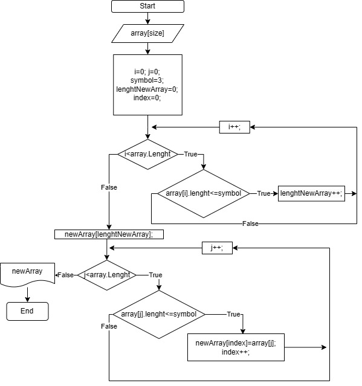

# Итоговая проверочная работа по 1 блоку.

>## Контрольная работа по итогу прохождения первого блока обучения.

### *__Задача:__ Из массива строк сформировать массив из строк, длина которых <= 3 символа.*


### 1. Блок схема алгоритма.


### 2. Описание решения 

*Получение данных массива*
- Ввод длины массива
- Ввод строк массива с клавиатуры

*Получение нового массива по условию*
- Переборка строк, получение длины нового массива
- Переборка строк, составление массива (выбор строк меньше или равно 3 символа)

*Вывод данных*
- Вывод нового массива и массива с ответом

### 3. Решение задачи `код на C#` => [Программа](https://github.com/RomanKhaykichev/First-block/blob/main/Program.cs)

*__Функции:__ Получение данных массива*

```
int Print(string message)
{
    Console.Write(message);
    return int.Parse(Console.ReadLine());
}

string PrintString(string message)
{
    Console.Write(message);
    return Convert.ToString(Console.ReadLine());
}

string[] FillArray(int lenght)
{
    string[] array = new string[lenght];
    for (int i = 0; i < lenght; i++)
    {
        array[i] = PrintString($"Введите {i + 1} строку массива: ");
    }
    return array;
}
```
*__Функции:__ Получение нового массива по условию*
```
int GetLenghtNewArray(string[] array, int symbol = 3)
{
    int lenghtNewArray = 0;
    string stringArray = string.Empty;
    for (int i = 0; i < array.Length; i++)
    {
        stringArray = array[i];
        if (stringArray.Length <= symbol) lenghtNewArray++;
    }
    return lenghtNewArray;
}

string[] GetNewArray(string[] array, int lenghtNewArray, int symbol = 3)
{
    string[] newArray = new string[lenghtNewArray];
    string stringArray = string.Empty;
    int index = 0;
    for (int i = 0; i < array.Length; i++)
    {
        stringArray = array[i];
        if (stringArray.Length <= symbol)
        {
            newArray[index] = stringArray;
            index++;
        }
    }
    return newArray;
}
```
*__Функции:__ Вывод данных*
```
void PrintArray(string[] array, string[] newArray)
{
    Console.WriteLine($"[{String.Join(", ", array)}] => [{String.Join(", ", newArray)}]");
}
```
*Сбор функций*
```
int lenght = Print("Задайте длину первоначального массива: ");
string[] getArray = FillArray(lenght);
Console.WriteLine("--Answer--");
int lenghtNewArray = GetLenghtNewArray(getArray);
string[] newArray = GetNewArray(getArray, lenghtNewArray);
PrintArray(getArray,newArray);
```